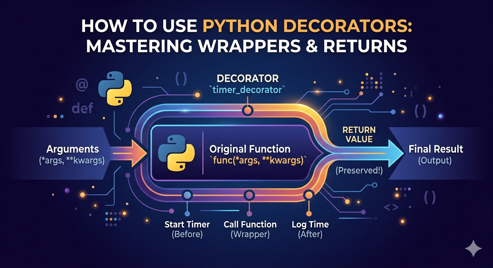

*Below contents are generated by Google Gemini AI.*

# What is a Python Decorator?

At its core, a Python decorator is a tool that allows you to modify or extend the behavior of a function (or class) without permanently changing its actual source code.

Think of it like wrapping a gift: the gift inside (your function) stays exactly the same, but the wrapping paper (the decorator) adds extra flair, protection, or features before someone opens it.

The below screenshot shows its workflow.



# How to create a decorator?

```
import functools

def my_decorator_name(func):
    """
    The outer function: Accepts the original function as an argument.
    """
    @functools.wraps(func)  # Preserves the original function's name and docstring
    def wrapper(*args, **kwargs):
        """
        The inner function: This replaces the original function and 
        handles the execution pool.
        """
        # 1. CODE HERE RUNS BEFORE THE ORIGINAL FUNCTION
        # (e.g., starting a timer, checking permissions, logging inputs)
        
        # 2. Execute the original function and capture its output
        result = func(*args, **kwargs)
        
        # 3. CODE HERE RUNS AFTER THE ORIGINAL FUNCTION
        # (e.g., stopping a timer, caching the result, logging outputs)
        
        # 4. Return the result so the calling code actually receives it
        return result
        
    # Return the inner wrapper function to complete the decoration
    return wrapper
```