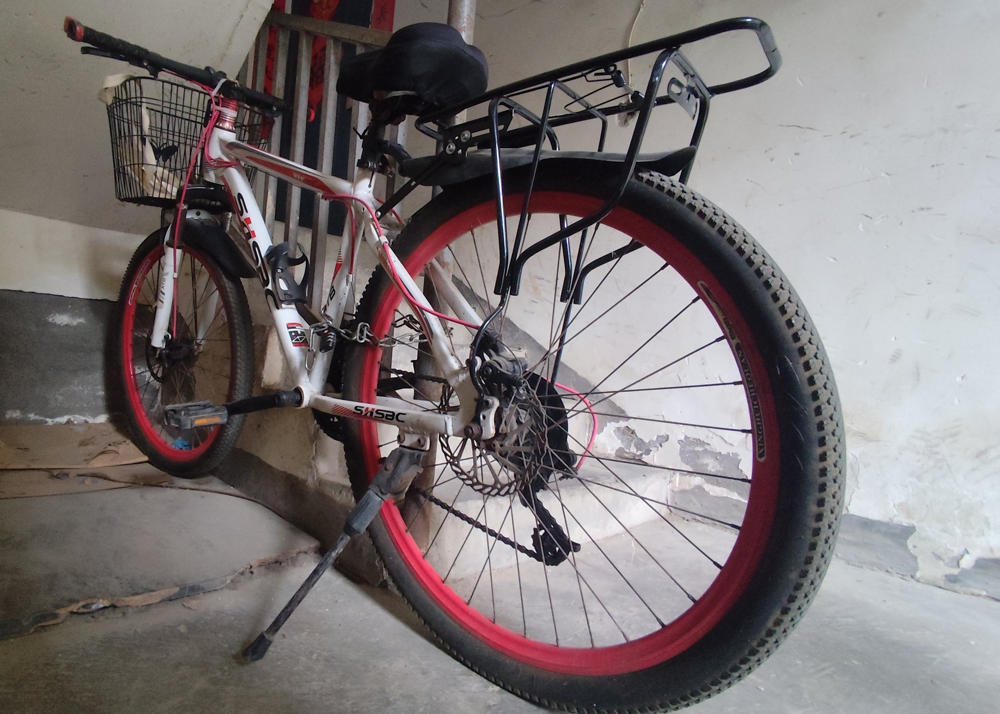

今天心血来潮，去镇上把我爸的闲置自行车骑进城，这样我就有一个免费的代步工具了，方便我经常骑车去图书馆。开心中！我给它取名**Little Red(小红)**。它的机械状态还不错，只是轮胎有点破旧了，表面有不少裂纹。暂时给它放在楼道口吧，这样有监控可以照到，希望别被偷走了。

（听说现在中国挺安全的，自行车不锁都没人偷，真是天下无贼了。）

好久没骑车了，现在的自行车和我读书时代差得挺多，除了自行车本身的价格飞升，还有各种琳琅满目的装备，得花不少时间才能搞明白。我不是骑行爱好者，同时骑自行车本身对男性的前列腺不是特别友好，所以也就不打算深入了解，让它做一个简单的代步工具即可。

不过，虽然不深究自行车的机械性能，但了解安全骑行的规则是必不可少的。首当其冲，**安全头盔**一定要准备好。这个头盔是4年前我送给老爸的，结果现在又回到了我手上。我给当时卖头盔的淘宝店铺咨询如何安全佩戴，客服回复我“**头盔没有说明，直接带上就好**”。我当时觉得对方这样的回答不是很专业，也很无语，要不是ta不负责，要不是就是真的无知，毕竟头盔要正确佩戴才能发挥其最大的保护作用。还好网上有不少视频分享，于是中午花了快一个小时学习如何安全佩戴，并且把头带的尺寸调节到最佳，这才满意且安心。

分享一些我在网上收集到的信息。

---

**安全使用自行车的专栏频道**

https://www.youtube.com/@SikanaChinese/search?query=%E8%87%AA%E8%A1%8C%E8%BD%A6

**正确佩戴自行车头盔**

https://youtu.be/EkRJZxOoYbw?si=tYE9BPzs5r4xMsDO

https://www.bilibili.com/video/BV1ojGGzVE36?share_source=copy_web

**如何安全锁车**

https://youtu.be/kkYHmTuL5vs?si=2Yevh3Q8DxPJ04Wb

https://www.bilibili.com/video/BV1YfHpzoEa5?share_source=copy_web

**如何换挡**

左边调节前面的换挡齿盘，数字越低越容易骑。最佳每分钟70-100转。

- 平路：高档
- 上坡：低档
- 下坡：高档

https://youtu.be/o2NMHRBDOL0?si=cdbBuQQc7Uc4041w

https://youtu.be/2cTY9gfRkic?si=kzGZWJes7XljcuB8

https://www.youtube.com/shorts/CIvN3fL9sOE

