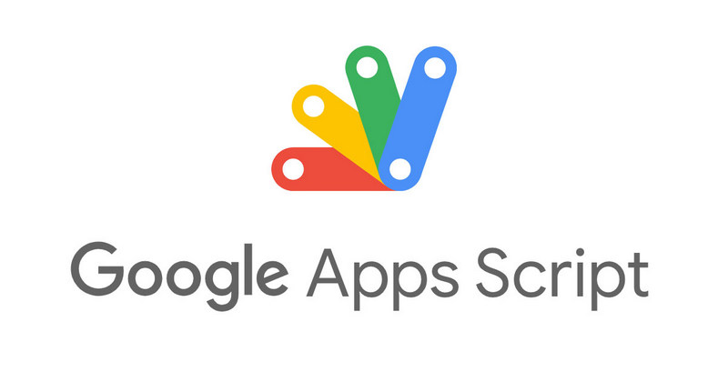

> I tried the Google APPs Script service today. Very impressive.

I wanted to set up a calendar event or scheduled email repeating on odd days of each month. I tried a few email apps (Outlook, QQ, and Gmail) as well as my phone calendar. Unfortunately, all of them failed to achieve what I needed.

Hence, I asked Google Gemini for help, and it advised me to try Google Apps Script. I had never heard of this web service before; hence, I wondered whether it would satisfy my needs or not. It turned out to be a great service that sent emails to me successfully by executing a JavaScript snippet.

I was very pleased to write down this happy moment.

Oh, forgot to mention, this service is FREE. Can you believe it? This service is similar to Microsoft Power Automate, but as a free user, I could not access it.

Lots of thanks and appreciation to Google. You rock it! ^_^
