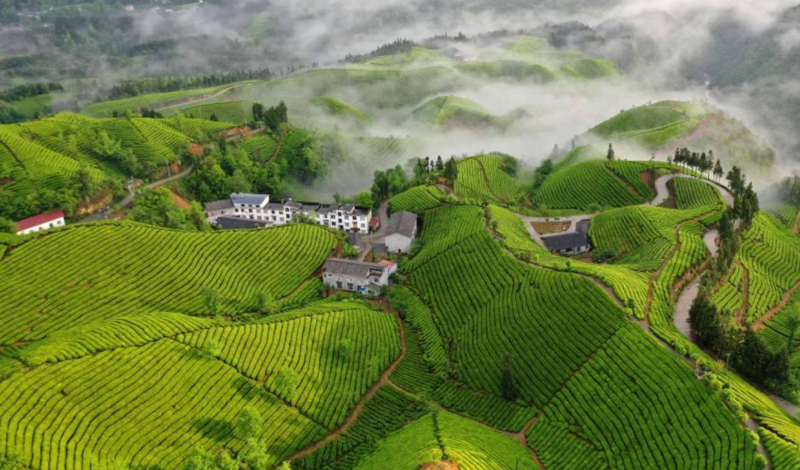

# 绿茶

|名称|产地|茶青方式|特色|冲泡|
|:------|:---|:------|:--|---:|
|茉莉花茶|四川雅安|炒青|再加工茶，川茶+广西横县茉莉花|80度水|

# 红茶

|名称|产地|茶青方式|特色|冲泡|
|:------|:---|:------|:--|---:|
|正山小种|福建武夷山桐木|高温快炒|菜茶茶叶|85度水|

# 乌龙茶

|名称|产地|茶青方式|特色|冲泡|
|:------|:---|:------|:--|---:|
|大红袍|福建武夷山||崖骨花香，醇厚回甘|95度水|
|东方美人|台湾||金萱乌龙茶叶|85度水|

# 黑茶

|名称|产地|茶青方式|特色|冲泡|
|:------|:---|:------|:--|---:|
|普洱茶|云南临沧|渥堆发酵|勐海大叶茶|95度水|

# 白茶

|名称|产地|茶青方式|特色|冲泡|
|:------|:---|:------|:--|---:|
|寿眉|福建福鼎|日晒|清鲜|95度水|
|安吉白茶|浙江安吉|日晒|清鲜|90度水|
