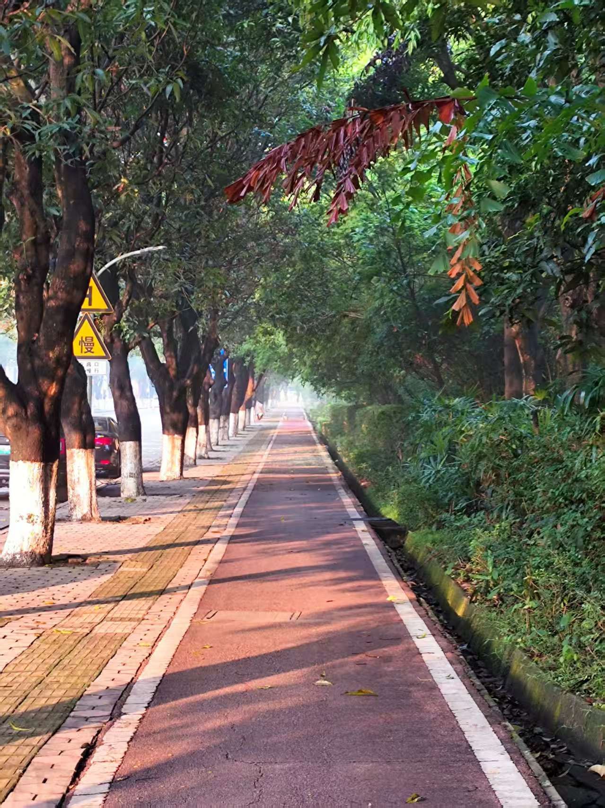
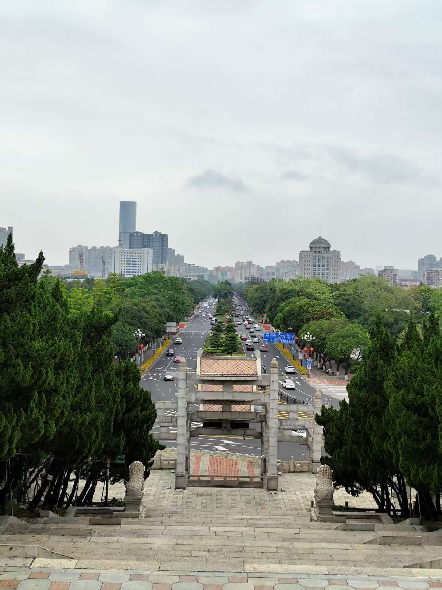
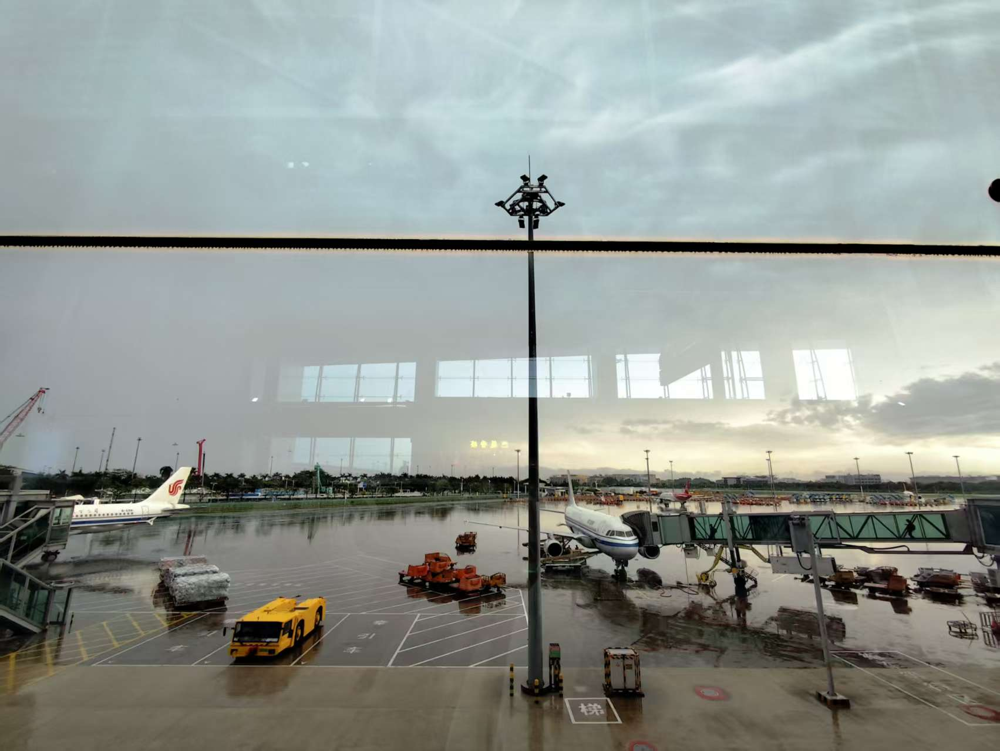

老陈今年搬到中山旅居已经有一段时间了，Linda大姐在回新西兰之前也打算到广州旅行，所以我也特地从四川飞到广东，和大家小聚。这次短暂的旅程一共持续了2周，我26年4月19日从成都出发抵达羊城然后转中山，5月3号离开广州返蓉。

去年深中通道开通之后，我当时刚好在深圳，所以在行程中安插了一天特地体验这个伟大的交通工具，也来拜访下这个传说中的美食之城，当时我住在石岐街道，去了步行街附近的景点，总体感觉是中山这座城市相对比较老旧，老龄化程度较高。

这次住在东区,老陈把主人房让给我，她居住的小区环境非常好，安静通风。而且小区靠近中山文化艺术馆，同时毗邻孙文纪念公园，周边环境对我特别友好，所以较上次来中山的比较，此次颇有好感，离开的时候还有一些不舍。

# 感恩的公共设施

孙文纪念公园植被丰富，绿树成荫，很适合运动，我每天绕着公园外的步行道跑两圈，即可完成每日5公里的慢跑目标，更感恩的是跑道顺着地形还有上下坡的设计，可以适当变速跑。最近中山白天的温度在25-30度之间，每天运动完之后都大汗淋漓，爽感十足。

另外隶属中山文化艺术馆的香山图书馆也是我每年都会去“打卡”的地方。这家图书馆几乎全年午休，每天开到晚上9点半才结束，有免费的中央空调和净水器，每个读书位都有插座提供，而且大部分阅读位还提供经典的阅读”银行灯“。我每天午休之后会到这个图书馆，接入自己手机的浏览，完成下午的工作，乐此不疲。希望以后我也能长期生活在优质的图书馆附近。

中山市区有许多老树，公园也不少，仿佛走到任何地方都能感受到绿意盎然。便利的交通（得益于深中通道），优美的环境，感人的物价让不少港澳居民到这边来置业，享受更加宽敞的居住环境和优越的医疗资源。谁曾想到，几百年前还是充满瘴气，充满蛇虫鼠蚁的流放之地，现在变得如此宜居和令人向往？

ps. 岭南地区现在还是很多虫子，一不小心就会在腿上、身上喜提“吻痕”。还好当地人卫生习惯不错，加上科普宣传到位，环境已经大大改善了。

# 感恩的美食

老陈今年慢慢转吃全素，工作日我们大部分时间都是在家里吃。她会烹饪美味的素餐佳肴给我，各种蔬菜应接不暇。我也是一位爱菜之人，所以也能吃得习惯，且是喜欢的。我并不是一位素食主义者，所以我有会自己吃鸡蛋，喝牛奶。好笑的是，我买的4支洋葱因为老陈现在的禁忌不能食用，我离开的时候，还把3支放进行李箱（有一支坏了）带回四川。感叹当时还好买得不多。

除了吃素，我们也去体验了很多中山的老字号餐厅，都是开了10几20年的街坊餐厅，比如“满足面”， “顺柚记”， “洪记面馆”，当然还少不了糖水(古乡居）和茶餐厅（岐妙园咖啡茶餐室）。这些餐厅的味道尽管不如“科技与狠货”，在吃第一口的时候就满足感爆炸，但却历久弥香，味道和食材的选用几十年保持高度一致，且价格实惠，分量十足，难怪能在内卷的餐饮赛道坚持下来，成为一代又一代人集体的味蕾记忆。OH，对了，我们还吃到了特别的广东果酱烧烤，新鲜的罗氏虾一支才8块钱，而且果酱烧烤没有辛辣味，不容易上火，吃了之后喉咙也没有觉得不舒适。

# 感恩的一期一会

此次来粤，除了如期和Linda大姐在广州相聚，还认识了一对情侣，其中一位还是老乡，泸州人。我们一起在广州逛了永庆坊，还品尝了著名的素食料理，菜品做得非常惊艳，让我对素餐大开“味界”。老陈还给我分享了一家即将在成都开业的米其林素餐品牌，叫”普门“，她说目前为止，还没有别的素食餐厅能超越它。 等它在四川开业之后，我也要找机会去一探究竟。

我还见到了新西兰的好友Jan。她和William已经移居澳洲2年，去年我回去新西兰也没能和他们见上面，但这次却在广州一起吃了早茶。我只能感叹：”缘，妙不可言也！”。

令我还特别惊喜的是，我们还意外地和“心住师傅”一起生活了3天时间。我此前在双月湾认识了“师傅”，她当时是一位冲浪教练，因和老陈机缘巧合去到一次山间修行之处，与佛法结缘，所以今年毅然决然选择了出家，散尽家财，开始修行证悟之旅。

Linda，Jan，“师傅”，下一次见面不知会到什么时候，因为大家都有不同的人生选择去体验，尽管现在科技方便能通过无线通讯保持联系，但这样面对面的交谈和时光更觉珍贵。时光荏苒，一期一会也。

# 末了

我因为担心在五一假期出行会遇到高速路上塞车，所以特意提前了一个小时出发。今天偶有小堵的情况，但大部分时间还是顺畅的，从中山到机场的巴士刚刚好二个小时到达机场送机层，整个车程平稳且舒适。

今天广州白云机场因为雨天影响，有一些航班出现了延误。 我现在陷在机场的按摩椅中，通过玻璃幕墙望出去，雨已经停了，远处放晴，且渐渐能看见蓝天的痕迹，希望一会儿我的航班能顺利准点出发。

感恩这2周美好的相遇和经历，大家各自珍重。

再会！

2026年5月3日

广州白云机场T1航站楼
B212登机口旁